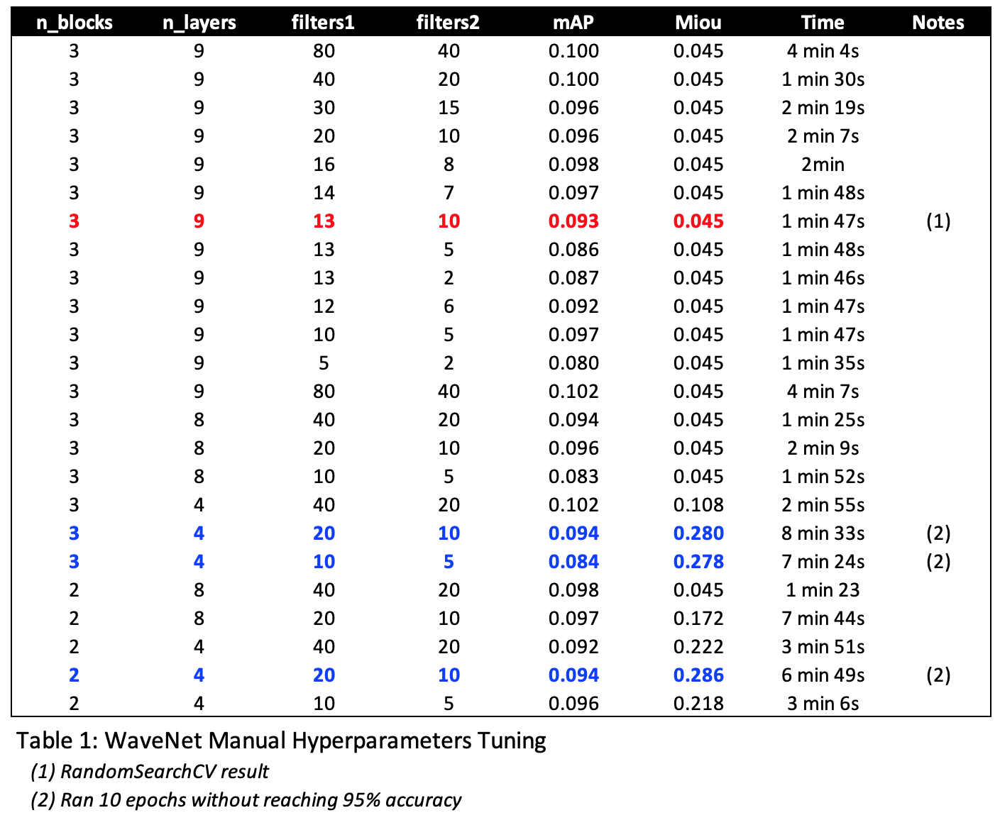

# Scene Segmentation

#### Author: Le Phan

## Table of Content

1. [Introduction](#intro)
2. [Setup](#section2)
3. [Get the data](#section3)
4. [Data processing](#section4)
5. [Training LSTM and WaveNet](#section5)
6. [Hyperparameters tuning](#section6)
7. [Performance evaluation](#section7)

<a id='intro'></a>
## 1. Introduction

Scenes are important part of storytelling in movies. Detecting semantic scene changes involve understanding the interactions between actors and their environments. The task for this project is to build a machine learning system that detect semantic changes in movie scenes. First, let us define a few vocabularies. A movie is a sequence of _shots_ and _scenes_ and they are quite different. A __shot__ is series of frames captured by a camera for an uninterrupted period of time. A __scene__ is a plot-based semantic unit that is made up of a series of shots.

The data is a set of 64 `<imbd id>.pkl` files provided by [eluv.io](https://eluv.io). Each file is a movie containing the following information:
* Movie-level: the movie's IMBD identification.
* Shot-level: four features (`place`, `cast`, `action`, and `audio`). These features are two-dimensional tensors extracted according to the encoding methods found in [(Rao et al.)](https://arxiv.org/pdf/2004.02678.pdf). The first dimension is the number of shots in the movie. The second dimension are 2048, 512, 512, 512, respectively.
* Scene-level:
    - Ground truth (`scene_transition_boundary_ground_truth`) which is a boolean vector labeling scene transition boundaries.
    - Preliminary scene transition prediction (`scene_transition_boundary_prediction`) is a prediction template indicating the probability of a shot being a scene boundary.
    - The `shot_end_frame` is used for evaluation purpose.
    
Now that we have the data related details out of the way, let us discuss the structure of the rest of this notebook. Section [2](#section2) and [3](#section3) are the typically setup to load the data. Section [4](#section4) go over the data processing and transformations. Section [5](#section5) builds and train LSTM and WaveNet models. Section [6](#section6') discusses hyperparameter tunning and Section [7](#section7) discusses model performance.

<a id='section2'></a>
## 2. Setup


```python
import numpy as np
np.random.seed(42)
import tensorflow as tf
from tensorflow import keras
import torch
import glob
import sys
import os
import joblib
import pickle

# Where to get the data
PATH = os.path.join(os.getcwd(), "data_dir")

# To plot pretty figures
%matplotlib inline
import matplotlib as mpl
import matplotlib.pyplot as plt
mpl.rc('axes', labelsize=14)
mpl.rc('xtick', labelsize=12)
mpl.rc('ytick', labelsize=12)
```

<a id='section3'></a>
## 3. Get the data

To load the data, we'll use the `fetch_movies()` function below to unpickle the files and load them into a list of Python dictionaries. Notice the length of the movies ranges from 600 shots to 3100 shots. We will use the maximum length later in the data transformation process so each training instance would have the same shape when fed into tensorflow.


```python
def fetch_movies(path=PATH):
    """
    Load .pkl movie files
    
    Argument:
    ---------
    path -- string representing files path
    """
    filenames = glob.glob(os.path.join(PATH, "tt*.pkl"))
    movies = []
    for fn in filenames:
        try:
            with open(fn, 'rb') as fin:
                movies.append(pickle.load(fin))
        except EOFError:
            break
    return movies
```


```python
movies = fetch_movies()
```


```python
# Get the train and test data sets
movies = fetch_movies()
```


```python
# Movie length
movie_lengths = [movie['place'].shape[0] for movie in movies]
print("Max movie length: {}".format(max(movie_lengths)))
print("Min movie length: {}".format(min(movie_lengths)))
```

    Max movie length: 3096
    Min movie length: 607


```python
FEATURES_DIM = 2048 + 512 + 512 + 512
MAX_MOVIE_LENGTH = 3100
NUM_EPOCHS = 10
```

<a id='section4'></a>
## 4. Data processing

Now that we got the data, we will build two custom functions, `split_train_test()` and `transform_movies()` to split the data set into training set and validation set as well as transform them from `torch.Tensor` to numpy arrays. The movies are padded in the transformation process with the `MAX_MOVIE_LENGTH` constant as noted earlier so they all have the same shape. We then call these functions to split and transform the data.


```python
def split_train_test(data, train_size=52):
    """
    Split data into train and test sets
    
    Argument:
    --------
    data -- a list of dictionaries each containing a movie information
    train_size -- integer representing the number of movies used for training
    """
    # For stable output across runs
    np.random.seed(42)
    # Shuffle indices
    shuffled_indices = np.random.permutation(len(data))
    train_indices = shuffled_indices[:train_size]
    test_indices = shuffled_indices[train_size:]
    train_set = [data[i] for i in train_indices]
    test_set = [data[i] for i in test_indices]
    return train_set, test_set
```


```python
from tensorflow.keras.preprocessing.sequence import pad_sequences

def transform_movies(movies, features=['place', 'cast', 'action', 'audio'], pad_len=MAX_MOVIE_LENGTH):
    """
    Unroll the given features by column and separate features from labels.
    Then pad the sequences in each movie to the length of the longest movie.
    
    Arguments:
    ----------
    movies -- a list of dictionaries each containing a movie information
    features -- list of string representing data features
    pad-len -- integer for the maximum length of a movie
    
    Return:
    -------
    X_padded -- a 2D numpy array
    Y_padded -- a 2D numpy array
    """
    X, Y = [], []
    # Unroll the features
    for movie in movies: 
        row = torch.cat([movie[feat] for feat in features], dim=1)
        X.append(row.numpy())
        # Pre-pad the label since its length is N-1
        labels = movie['scene_transition_boundary_ground_truth']
        labels = torch.cat([torch.tensor([False]), labels])
        Y.append(labels.numpy())
    # Pad the sequences
    X_padded = pad_sequences(X, maxlen=pad_len, padding='post', dtype='float32')
    Y_padded = pad_sequences(Y, value=False, maxlen=pad_len, padding='post')
    return X_padded, Y_padded
```


```python
# Split movies into training and validation sets
movies_train, movies_val = split_train_test(movies)
```


```python
# Transform training and validation sets
X_train, y_train = transform_movies(movies_train)
X_val, y_val = transform_movies(movies_val)
```

<a id='section5'></a>
## 5. Train LSTM and WaveNet

Since the training instances are sequences of shots, the logical models would be that of a recurrent neural network (RNN) architecture. However, simpple RNNs do not work well with long sequences. At each time step, the RNN only take the current input and an activation value from the previous time step to make prediction for the current time step. This means a RNN cannot learn from sequences that have long-term dependencies. In particular, if the network is very deep, then the gradient from the output will have a hard time propagating back to affect the earlier layers. That is, as the data traverses the RNN it goes through a series of transformations and after a while, there is very little trace of the first inputs.

To combat this problem, we can use __Long Short-Term Memory (LSTM)__ cell which is better at detecting long-term dependencies in the data. It uses update and forget gates that allow the cell to keep more information from the earlier time step compared to RNN. LSTM training is also faster than RNN.

Another method to deal with long sequences is the __WaveNet__ architecture introduced in a [2016 paper](https://arxiv.org/abs/1609.03499) by researchers at DeepMind. WaveNet stacks a group of 1D convolutional layers while doubling the dilation rate at every layer. Dilation rate means how far apart each neuron's inputs are. The first layer sees two time steps at a time while the next see four time steps, and so on. In essence, the lower layers in the stack learn short-term patterns while the higher layers learn long-term patterns. This network is extremely fast -- even for long sequences.

Before building LSTM and WaveNet, we will build a customized `callback` class which we will pass as argument to the model's `fit()` method. This will allow the training to stop early when accuracy reaches 95%.


```python
class myCallback(tf.keras.callbacks.Callback):
    """To stop training early once accuracy reach 95%"""
    def on_epoch_end(self, epoch, logs={}):
        if(logs.get('accuracy') > 0.95):
            print("\nReached 95% accuracy, so cancelling training!")
            self.model.stop_training = True
```

<a id='section5.1'></a>
### 5.1 LSTM model


```python
def build_lstm(n_layers=2, n_neurons=32, input_shape=[None, FEATURES_DIM]):
    model = keras.models.Sequential()
    model.add(keras.layers.InputLayer(input_shape=input_shape))
    for _ in range(n_layers):
        model.add(keras.layers.Bidirectional(keras.layers.LSTM(units=n_neurons,
                                                               return_sequences=True)))
    model.add(keras.layers.TimeDistributed(keras.layers.Dense(1, activation='sigmoid')))
    model.compile(loss='binary_crossentropy',
              optimizer=keras.optimizers.RMSprop(lr=2e-5),
              metrics=['accuracy'])
    return model
```


```python
%%time
# Fit LSTM classifier
lstm_clf = build_lstm()
lstm_clf.fit(X_train, y_train, 
             epochs=NUM_EPOCHS, 
             callbacks=[myCallback()], 
             validation_data=(X_val, y_val), verbose=2)
```

<a id='section5.2'></a>
### 5.2 WaveNet model


```python
def build_wave_net(input_shape=[None, FEATURES_DIM], num_blocks=2, num_layers=4, 
                   filters1=10, filters2=5, kern1=2, kern2=1, padding='same'):
    rates = [2**i for i in range(num_layers)]
    wave_model = keras.models.Sequential()
    wave_model.add(keras.layers.InputLayer(input_shape=input_shape))
    for rate in rates * num_blocks:
        wave_model.add(keras.layers.Conv1D(filters=filters1, 
                                              kernel_size=kern1, 
                                              padding='same',
                                              activation='relu', dilation_rate=rate))
    wave_model.add(keras.layers.Conv1D(filters=filters2, kernel_size=kern2))
    wave_model.add(keras.layers.Dense(1, activation='sigmoid'))
    wave_model.compile(loss='binary_crossentropy',
                       optimizer=keras.optimizers.RMSprop(lr=2e-5),
                       metrics=['accuracy'])
    return wave_model
```


```python
%%time
# Fit WaveNet classifier
wave_clf = build_wave_net()
wave_clf.fit(X_train, y_train, 
             epochs=NUM_EPOCHS, 
             callbacks=[myCallback()], 
             validation_data=(X_val, y_val), verbose=2)
```

<a id='section6'></a>
## 6. Hyperparameters tuning

As seen above, the WaveNet architecture while deeper than the simple LSTM, it runs faster. Thus, we will be focusing on tunining the hyperparameter for WaveNet and use it as the final model. We'll take advantage of the `KerasClassifier` wrapper that allows us to use Scikit-Learn's functions with the WaveNet. Additionally, we will tune the hyperparameters using `RandomizedSearchCV` which randomly sample a smaller subset of the hyperparameter space. This is faster than `GridSearchCV` where search is conducted on a larger hyperparameter space.

<a id='section6.1'></a>
### 6.1 LSTM tuning


```python
from tensorflow.keras.wrappers.scikit_learn import KerasClassifier
from sklearn.model_selection import RandomizedSearchCV

lstm_keras_clf = KerasClassifier(build_lstm)

lstm_params_distribs = {
    "n_layers": np.arange(1, 11),
    "n_neurons": [2, 4, 8, 16, 32, 64]
}

lstm_rnd_search_cv = RandomizedSearchCV(lstm_keras_clf, lstm_params_distribs, n_iter=3, cv=3)
```


```python
%%time
lstm_rnd_search_cv.fit(X_train, y_train, epochs=NUM_EPOCHS, 
                       validation_data=(X_val, y_val),
                       callbacks=[myCallback()], verbose=2)
```


```python
print("Best score: {}".format(lstm_rnd_search_cv.best_score_))
print("Parameters:")
for param, value in lstm_rnd_search_cv.best_params_.items():
    print("\t{}: {}".format(param, value))
```

    Best score: 0.9564256270726522
    Parameters:
    	n_neurons: 2
    	n_layers: 8


<a id='section6.2'></a>
### 6.2 WaveNet tuning


```python
from tensorflow.keras.wrappers.scikit_learn import KerasClassifier
from sklearn.model_selection import RandomizedSearchCV

wave_keras_clf = KerasClassifier(build_wave_net)

wave_params_distribs = {
    "num_blocks": [2, 3],
    "num_layers": np.arange(4, 11),
    "filters1": np.arange(10, 21),
    "filters2": np.arange(2, 11)
}

wave_rnd_search_cv = RandomizedSearchCV(wave_keras_clf, wave_params_distribs, n_iter=3, cv=3)
```


```python
%%time
wave_rnd_search_cv.fit(X_train, y_train, epochs=NUM_EPOCHS, 
                       validation_data=(X_val, y_val),
                       callbacks=[myCallback()],
                       verbose=2)
```


```python
print("Best score: {}".format(wave_rnd_search_cv.best_score_))
print("Parameters:")
for param, value in wave_rnd_search_cv.best_params_.items():
    print("\t{}: {}".format(param, value))
```

    Best score: 0.9616220394770304
    Parameters:
    	num_layers: 9
    	num_blocks: 3
    	filters2: 10
    	filters1: 13


Now that we have a good sense of the best hyperparameters, let us build a model based on these parameters. First, we will transform the full dataset and fit the best model on this full dataset. Recall that we padded the dataset so that all instances have identical input shape even though the movies are of different length. We will now need to reverse that padding by truncating the predictions so that the predictions for each movie have the same length at the movie itself. Then to write the prediction out to file for evaluation, we will use the `write_predictions()` function.

Note that the required model evaluation metrics by Eluv.io are the __Mean Average Precision(mAP)__ and the __Mean Maximum IoU (mean Miou)__. The evaluation script, `evaluate_sceneseg.py` can be found at the Eluv.io's team [Github page](https://github.com/eluv-io/elv-ml-challenge).


```python
def unpad_predictions(movies, yhat_probs):
    """
    Truncate the padded predictions to movie's original length
    
    Arguments:
    ----------
    movies -- a list of dictionaries containing movies information
    yhat_probs -- a 2D numpy array representing prediction for the given movies data set
    
    Return:
    -------
    yhat_dict -- a dictionary with each movie imbd_id as key and 
                 prediction probabilities as a 1D numpy array
    """
    imdb_lengths = [(movie['imdb_id'], movie['place'].shape[0]) for movie in movies]
    yhat_dict = dict()
    for (imdb, length), yhat in zip(imdb_lengths, yhat_probs):
        yhat = yhat[1:length]
        yhat_dict[imdb] = yhat
    return yhat_dict
```


```python
def write_predictions(yhat_unpadded_dict, path=PATH):
    """
    Pickle the predictions
    
    Arguments:
    ----------
    yhat_unpadded_dict -- a dictionary of prediction consistent with the length of the ground-truth label
    path -- a string representing the files path
    """
    for imdb in yhat_unpadded_dict.keys():
        # Load existing pkl movie file
        filename = os.path.join(PATH, imdb + ".pkl")
        try:
            x = pickle.load(open(filename, "rb"))
            x['scene_transition_boundary_prediction'] = yhat_unpadded_dict[imdb].flatten()
            pickle.dump(x, open(filename, "wb"))
        except:
            break
```


```python
# First, transform the entire dataset 
X, y = transform_movies(movies)
```

Let us rebuild the WaveNet using the best hyperparameters and fit it on the entire dataset.


```python
%%time
wave_clf_best = build_wave_net(num_layers=9, num_blocks=3, filters1=13, filters2=10)
wave_clf_best.fit(X, y, epochs=20)
```


```python
# Predict and pickle results
yhat_wave = wave_clf_best.predict(X)
yhat_wave_unpadded = unpad_predictions(movies, yhat_wave)
write_predictions(yhat_wave_unpadded)
```

<a id='section7'></a>
## 7. Performance evaluation

In term of execution speed, WaveNet is much faster than LSTM by order of magnitude -- especially during hyperparameters tunning. __LSTM is prohibitively slow compares to WaveNet!__ Thus, much of the performance evaluation in this section will focus on the WaveNet model.

To tune the hyperparameters, a round of random search cross-validation was carried out using tensorflow's `RandomSearchCV` class. This was done using 3-fold cross validation, three iterations, and an early stop criteria of 95% accuracy. Base on the result of the random search, another round of manual tuning was conducted which result in Table 1 below. 

Let $N$ be the number of blocks in the WaveNet and $L$ be the number of dilation layers in the block, we can derive the following insights:

* The number of filters used in the WaveNet does not materially impact performance metrics when $N > 3$ and $L > 4$.
* $N$ and $L$ has greater impact on performance metrics than the number of filters.
* Miou metric is almost unaffected by changes in hyperparameters.




```python

```
